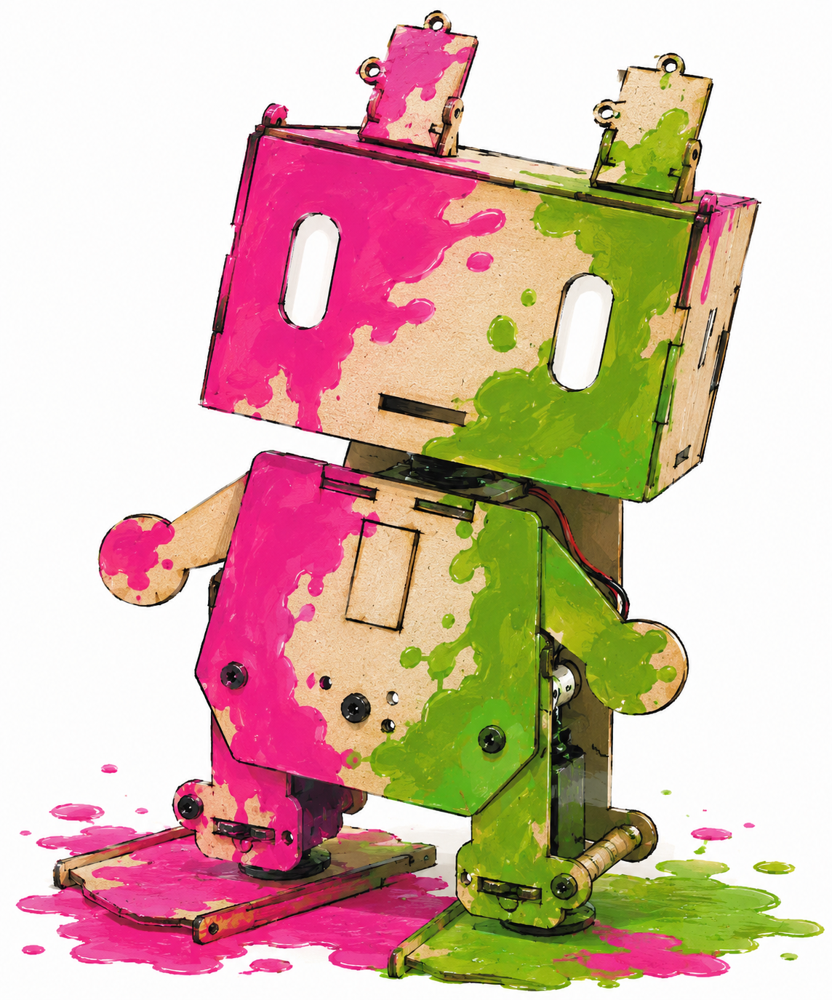

# Robot AR Marker Tracker



Real-time ArUco marker tracking for small robots using a PC camera.

## Setup

```sh
uv sync
```

## Project Page

This repository includes a static project page in `docs/`. To publish it with
GitHub Pages, open the repository settings on GitHub, choose **Pages**, set the
source to **Deploy from a branch**, and select the `docs/` folder from the main
branch.

## Run the Tracker

```sh
uv run python hello.py --robot-ids 0 1
```

## Generate a Marker

Print one marker per robot and attach it flat on top of the robot.

```sh
uv run python hello.py --generate-marker 0 --output marker-0.png
uv run python hello.py --generate-marker 1 --output marker-1.png
```

The generated image includes a white margin around the marker. The default
dictionary is `4x4_50`; use the same dictionary when generating and tracking
markers.

## Track from the Camera

```sh
uv run python hello.py --target-id 0
```

For two robots, track both marker IDs at the same time:

```sh
uv run python hello.py --robot-ids 0 1
```

The Qt control window draws each detected marker border, center point, ID,
heading, frame rate, and broad colored trajectory. Trajectories are drawn in
movement order, so a robot can overwrite territory by driving over the
opponent's older trajectory. Support items are shown on the control and
spectator views. The spectator window displays each player's share of painted
territory, the remaining game time, and the winner when the timer ends.

The camera feed is shown inside the main window. Use the right
control panel for mushroom placement, territory clearing, match reset, and
camera/projector calibration. Two secondary windows open alongside the control
window: a spectator window with the score bar, timer, and winner display, and a
projector window that shows only the video output and trajectories. Use
`Show Spectator Window` or `Show Projector Window` to hide or reopen each
window, and press `F11` inside either window to toggle fullscreen.
Manual territory assignment is available through the `Manual Draw P0` and
`Manual Draw P1` tool buttons. While one of those tools is active, drag with
the left mouse button on the control window video to paint territory for that
player. Right click continues to remove the nearest mushroom while mushroom
placement mode is active.

Useful options:

- `--list-cameras`: probe local camera indexes and exit.
- `--camera-index 1`: use another camera.
- `--camera-source <url-or-file>`: use an IP/RTSP/HTTP camera URL or video file.
- `--width 1920 --height 1080`: request a different capture resolution.
- `--dictionary 5x5_100`: use another ArUco dictionary.
- `--trajectory-length 1200`: keep more path history per robot.
- `--min-trajectory-distance 5`: add path points only after larger pixel moves.
- `--trajectory-thickness 24`: make territory paths broader.
- `--trajectory-output result.png`: choose where to save the final trajectory image.
- `--game-duration 180`: set the match time in seconds (0 disables the timer).
- `--item-radius 28`: adjust the size of support item markers.
- `--item-pickup-radius 40`: set the pickup range for support items.
- `--mushroom-duration 8`: set how long the size boost lasts.
- `--mushroom-size-multiplier 1.6`: set the size multiplier during a boost.

## iPhone Camera

On macOS, iPhone Continuity Camera usually appears to OpenCV as one of the
numeric camera indexes. The index can change, so probe it before tracking:

```sh
uv run python hello.py --list-cameras
```

Then run tracking with the index that shows the iPhone view:

```sh
uv run python hello.py --camera-index 1 --robot-ids 0 1 --trajectory-thickness 96
```

If Continuity Camera does not appear reliably, use an iPhone camera app that
publishes an HTTP, RTSP, or similar stream, then pass that stream URL:

```sh
uv run python hello.py --camera-source http://IPHONE_ADDRESS:PORT/video --robot-ids 0 1 --trajectory-thickness 96
```

For an overhead camera, `x`, `y`, and territory sizes are measured in camera
image pixels. Calibrate the camera and field later if you need real-world field
coordinates or square-centimeter territory scoring.


## 俳句（Python 追加）

静かな夜
Python の蛇行く
バグほどける

### 解説

「静かな夜」で集中してコードに向き合う時間を置き、「蛇行く」で Python の名にある“蛇”のイメージと、処理が流れて進む感覚を重ねています。結句の「バグほどける」は、絡まった問題が少しずつ解ける瞬間を表しました。短い三行で、実装中の緊張と解決の安堵を対比しています。

## Haiku

> カメラ越し　マーカー光る　ロボの道

**読み:** かめらごし　マーカーひかる　ロボのみち

**五・七・五の構成:**

| 句 | 読み | 意味 |
|---|---|---|
| カメラ越し（5） | かめらごし | PCカメラのレンズ越しに、見えない世界を見通す |
| マーカー光る（7） | マーカーひかる | ArUcoマーカーが画像処理によって検出され、輝きを放つ |
| ロボの道（5） | ロボのみち | ロボットが自らの軌跡＝「道」を描いていく |

**解説:** カメラという"目"を通して初めてロボットの位置と向きが明らかになる。マーカーが「光る」という表現は、検出のアルゴリズムが無機質な映像の中からマーカーを識別・可視化する瞬間を擬人化したもの。そしてロボットが描き続ける軌跡は、領土争いの「道」でもあり、実験の記録でもある。
